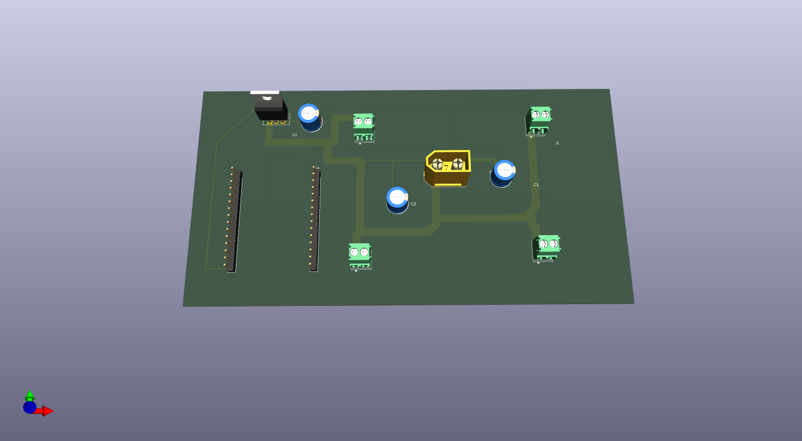

# PDB_KiCAD_Design
Contains all the files such as the schematic, PCB layout and Gerber files for power distribution board. there is a need for optimization in terms of space and wiring. Though a standard circuit for a generic PDB , This circuit was designed with a Quadcopter in mind. 

* The pins were added based on the ESP 32 models , the distance between the pin rows is 24.5 mm 
* 2 470 micro farad capacitors and 1 polarized capacitor to protect the components from a sudden spike in voltage.
* A voltage regulator to ensure 5 V is safely supplied to the board.
* 4 Connect pins for ESCs for the connection of BLDC motors.
* The folowing was designed with a 3S LiPo battery in mind.
* A male Xt60 Connector was used for the battery connection.

